# Overview
An online multiplayer realtime card game. The first player to get 3 chickens wins the game.
Tech Stack: Supabase + Bun / Vite / Vue

# Architecture
The project consists of the following modules:
- **Core:** Models and Service Interfaces
- **Resources:** Icons, fonts, binary files, static files, etc
- **App:** All app services, each implementing its related interface.
  - **\[Service\]:** Implementation of each app service. The 'App' module includes many of these.
- **Gui:** The Vue app. Service dependencies are passed down by Provide / Inject, other (usually ui-related) dependencies by prop-drilling.

## Module Dependencies:
- **Core:** Nothing
- **Resources:** Nothing
- **App:** Core, Resources and non-UI external libraries (if required)
  - **\[Service\]:** Implementation of some service interface.
- **Gui:** App (recursively), Vue and External UI-related libraries (if required).

## File Structure
The project's file structure reflects the architecture, as described below.
  - **core:** The **Core** module
    - **models:** The directory where non-service models (i.e. entities) are located.
    - **utility**: The directory where useful repetitive types and functions are located.
    - **\[Service\](.ts):** Either a directory with an `index.ts` file or a pure `.ts` file, declaring a specified service interface and their related models (i.e. request / response types, etc).
  - **app:** The **App** module
    - **\[ServiceImpl\](.ts):** Either a directory with an `index.ts` file or a pure `.ts` file, implementing a specified service interface.
      - **\[Model.ts\]:** For large services with multiple private service-related models, they'll be defined here as separate files.
  - **res:** The **Resources** module
  - **gui:** The **Gui** module directory where the UI lives

## Models

```mermaid
classDiagram
  class Card {
    <<enum>>
    Hen
    Rooster
    Nest
    Fox
    Snake
    Trap
  }
  class Game {
    id: int
    name: string
    state: string
    players: Player[]
    messages: Message[]
    currentPlayer: int | null
    getCurrentPlayer() Player | null
    pending: GamePending | null
  }
  class GamePending {
    action: GameAction
    timeout: timestamp
    lastResponse: GameActionResponse | null
  }
  class Player {
    id: int
    name: string
    eggs: int
    chickens: int
  }
  class Message {
    id: int
    sender: int
    message: string
  }
  class GameInfo {
    id: int
    name: string
    state: string
  }
  class GameActionType {
    <<enum>>
    SkipTurn
    LayEgg
    HatchEgg
    FoxSteal
    SnakeEat
    TrapKill
    DefendFoxSteal
  }
  class GameAction {
    type: GameActionType
    actor: Player
    cards: Card[]
    params: FoxStealParams | SnakeEatParams | TrapKillParams | null
  }
  class FoxStealParams {
    target: Player
  }
  class SnakeEatParams {
    target: Player
    eggCount: int
  }
  class TrapKillParams {
    target: Player
    finish: boolean
    card: Card | null
  }
  class GameActionResponse {
    type: GameActionType
    isComplete: boolean
    isAwaitingActor: boolean
    isAwaitingTarget: boolean
    params: TrapKillResponseParams | null
  }
  class TrapKillResponseParams {
    targetHand: Card[] | null
  }
  %% Relationships
  Game "1" *-- "many" Player
  Game "1" *-- "many" Message
  Game <|-- GameInfo
  Game ..> GameAction
  Game ..> GamePending
  GameAction ..> GameActionType
  GameAction ..> FoxStealParams
  GameAction ..> SnakeEatParams
  GameAction ..> TrapKillParams
  GameAction ..> Card
  GameActionResponse ..> TrapKillResponseParams
  TrapKillParams --> Card
  TrapKillResponseParams --> Card
```

**Notes:**
  - *Game.currentPlayer:* int for Player.id while state = "playing", else null
  - *Message.sender:* int for Player.id when a player message, null for system messages and notifications
  - *GameAction.cards:* Each element refers to either a card in the Actor's hand, and it may contain 1 to 3 cards depending on the action type.
  - *GameActionResponse.targetHand:* Only used when the action is `TrapKill`, and includes the target player's Hand for the actor to select which card to kill.
  - *TrapKillParams:*
    1. On first request, `finish` is set to false and `card` to null. It receives a `GameActionResponse` with `targetHand` set to the target's hand.
    2. Then (on second request), `finish` is set to true and `card` set to the selected animal card to kill (or null if there are no animal cards to kill).
  - *Game.pending:* is not null when there's a pending action. In which case, only defense actions (those starting with 'Defend') can be requested (by the target of the pending attack). The only case that matches this criteria currently is 'DefendFoxSteal' (allowed by the Target of the pending 'FoxSteal').
  - *GamePending.response:* is only visible to the players with access (i.e. if TrapKill, only to Actor, if FoxSteal only to Actor and Target)
  - *GamePending.timeout:* is the UTC time at which the pending action times out, and for now we can set it to 30 seconds after the action is requested.
## Utilities

**Notes:**
  - *IEvent:* An interface for easier handling of the observer pattern
  - *Event:* Implements IEvent

## Services

# User Stories
User stories are separated into multiple stages, each preferably (strongly suggested but not strictly) separated by a gui page.
When the system starts, the root app page decides which page to show based on the state of the app (whether the user is logged in, whether they're in-game right now, etc.)

## Auth Stage:
1. User should be able to sign-up using simple username (or email) and password pair, by verifying their email address.
2. User should be able to sign-in using simple username and password pair.
3. Auth.uid will be used as User Id and `Player.id` throughout the app.

## User Stage:
1. User should be able to create a game, or join a game created by another user.
2. User can only join one game at a time. If they want to join another game, they should first leave the one they currently joined. (Preferably, the lobby page is skipped if the user in-game and jumped to the game page)

## Game Stage:
1. There must be a realtime channel open for each player that allows them to subscribe to game events. This can either be a websocket or SSE (whichever the tech stack is more friedly towards). If a player refreshes the page, they will receive the full state of the game right after opening and subscribing to this channel to ensure consistency.
2. The game starts after A) There's at least 2 players in the game, and B) All players in the game set their `ready` state to true.
3. All players who have joined a game are allowed to participate in the game's text-based global chat, either before or after the game has started.
4. The game's `messages` contains players' chat as well as system messages, which are emmited per action or per players joining or leaving.
5. The game does not allow new players to join the game after the game has started.
6. If a player leaves the game (by clicking the 'Leave Game' button), their cards will be discarded (go to the discarded cards stack) and they'll lose the game. They won't be able to join that game again (cuz it has already started and state = "playing" (or "finished" if only 1 player remains))
7. The player should be able to see the playing cards in their hand only. Score cards (eggs and chickens) are visible to everyone.
8. The game is turn-based, the order the players draw cards is random and determined once at the start of the game (remains consistent until the end of the game)
9. The number of cards in a player's hand must always be equal to 4. If by playing an action (or a defence) their cards are used, new cards will replace them from the deck.
  - On game start all players receieve 4 cards from the deck.
  - After every action, the actor will receive their new cards at the end of turn (before setting `currentPlayer` id to the next one)
  - After every defense, the defender / target will receive their new cards immediately (before the actor / attacker's turn is finished)
11. The player should be able to draw a combination of cards by selecting them on the UI then pressing the Draw button. The draw button should be active if the card combination matches one of the following (with extra rules if required):
  - Nest + Rooster + Hen: Can always draw. It will result in getting one egg.
  - Hen + Hen: Can draw only if there's at least one egg. It hatches the egg into a chicken.
  - Fox: Can draw if another player has at least 1 egg. Workflow described below.
  - Snake: Can draw if another player has at least 1 egg. Workflow described below.
  - Trap: Can always draw. Workflow described below.
12. When Player X draws Fox: They will choose another player who has at least 1 egg to steal from, let's call them Player Y.
  - If Y has at least 2 roosters, then they have the option to defend or let the eggs be stolen. The option is shown to them (in realtime, e.g. X is trying to steal your egg) and they'll choose whether to defend the egg by playing the 2 Rooster cards at that moment (outside of their turn).
  - If Y doesn't have 2 roosters, the egg will be stolen. The option to defend will be disabled for Y, but still shown.
  - X's turn must wait for Y's response (it won't end until Y responds, or their response times out)
  - The timeout will cause the egg to be stolen
  - If X steals Y's egg, the egg will be removed from Y and added to X.
13. When Player X draws Snake: They will choose another player who has at least 1 egg to eat from, let's call them Player Y.
  - If Y has only 1 egg, that egg will be eaten by the snake (removed from Y, NOT added to X)
  - If Y has more than 1 egg, then X can choose to eat either 1 or 2 eggs.
14. When Player X draws Trap: They will choose another player to target, let's call them Player Y.
  - X can watch Y's hand (This is the ONLY instance where a player can see another player's hand, the server shouldn't allow it otherwise)
  - If Y has at least one Animal card (Hen, Rooster, Snake, Fox), X must choose one of them to kill.
  - If the pending action of X choosing an animal times out, One of Y's animals is randomly chosen.
  - If Y has no animal cards, X can't do anything further (Their trap card will still be used). X should still see the hand, and choose when to discard their trap card by pressing a button (or letting the pending action time out).
15. If the player can play any of the above actions, their turn will end. Otherwise (if they can't play any cards) they'll have to skip turn by choosing to return one card to the deck (and getting a new one in return after the turn's end).
16. After a `GameAction` is completed (isComplete: true), the `currentPlayer` ID must automatically increment to the next player in the predefined sequence. This increment should happen upon setting the action to complete on backend, and everyone will be notified through the realtime channel.
17. All the logic specified above must be validated on both frontend and backend. The backend would use Postgres Functions for simple validations and Edge functions (if required) for more complex game actions.
18. The Deck and the Discard stack are both handled on the backend. Hands are returned to the users when required.
  - The deck should be shuffled on game start
  - Used / Discarded cards go to a discard stack
  - Once there's less than 4 cards in the deck, discarded cards are reshuffled and returned to the bottom of the deck